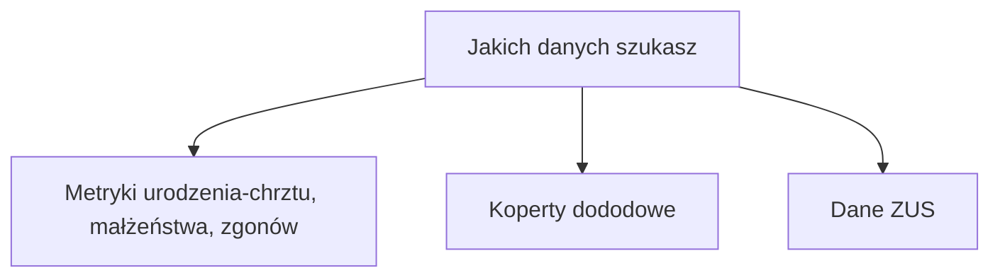

# General
A short subjective interactive guide regarding the search for information about predecessors.

## Jakich danych szukasz:
### Metryki urodzenia-chrztu, małżeństwa, zgonów
#### Jaki jest estymowany Rok w którym zdażenie miało miejsce
#### ~<1924 - Metryki kościelne - akta archiwalne
#### młodsze niż 1924 - USC
### Koperty dowodowe
### Dane ZUS

Here is a simple flow chart:

